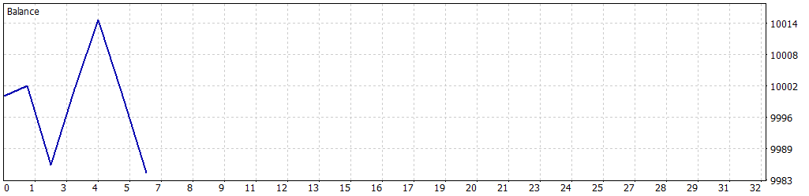

# edNewsTraderPro 🚀
### Expert Advisor MT5 Modular Berbasis Kalender Berita Ekonomi (Multi-Strategy & Multi-Pair)

[](https://www.mql5.com/)
[](https://www.mql5.com/en/docs)
[]()
[](LICENSE)

**edNewsTraderPro** adalah robot trading / Expert Advisor (EA) otomatis untuk MetaTrader 5 yang dirancang khusus untuk memanfaatkan volatilitas momentum rilis berita ekonomi berkategori *High Impact* (seperti NFP, US CPI, FOMC, Suku Bunga ECB/BOE/FED, GDP, dan Retail Sales).

Dibangun menggunakan standar arsitektur **Object-Oriented Programming (OOP)** yang modular, terstruktur, dan tahan terhadap *slippage* serta lonjakan *spread* pasar.

---

## 📑 Daftar Isi
1. [Fitur Utama](#-fitur-utama)
2. [Struktur Proyek](#-struktur-proyek)
3. [Panduan Instalasi Cepat (1-Klik)](#-panduan-instalasi-cepat-1-klik)
4. [Dua Strategi News Trading](#-dua-strategi-news-trading)
5. [Tabel Parameter Konfigurasi](#-tabel-parameter-konfigurasi)
6. [Rekomendasi Preset per Simbol](#-rekomendasi-preset-per-simbol)
7. [Panduan Backtesting & Hasil Pengujian](#-panduan-backtesting--hasil-pengujian)
8. [Panduan Pengembang (Menambah Modul Baru)](#-panduan-pengembang-menambah-modul-baru)
9. [Disclaimer](#-disclaimer)

---

## 🌟 Fitur Utama

- **Dual-Engine News Provider**:
  - **Native MT5 Calendar**: Menggunakan fungsi bawaan `CalendarValueHistory` secara real-time.
  - **Manual / Offline Timetable (CSV)**: Mendukung backtesting offline 100% menggunakan file CSV kalender historis (`news_calendar_3years.csv`) di folder `MQL5\Files` atau `Common\Files`.
  - **Mode Hybrid**: Otomatis memprioritaskan kalender MT5 saat live dan fallback ke CSV saat offline/tester.
- **Multi-Strategy Execution**:
  - **Pre-News Straddle Breakout**: Memasang *Buy Stop* dan *Sell Stop* beberapa detik menjelang rilis berita dengan fitur auto-cancel OCO (*One-Cancels-the-Other*).
  - **Post-News Candle Breakout**: Menunggu spread mereda pasca-rilis, kemudian mengukur titik *High/Low* candle rilis (M1/M5) dan memasang pending order breakout dengan buffer.
- **Proteksi Risiko & Eksekusi Cepat**:
  - **Max Spread Filter**: Membatalkan penempatan order jika spread melompat di atas batas aman.
  - **Max Slippage Protection**: Mencegah eksekusi order pada harga yang melenceng terlalu jauh.
  - **Dynamic ATR Stop Loss / Take Profit** atau **Fixed Points SL/TP**.
  - **Auto Breakeven (BEP)** & **Trailing Stop** otomatis.
  - **Time-Based Auto Exit**: Menutup transaksi secara otomatis setelah waktu tahan tertentu (momentum rilis selesai).
- **On-Chart HUD Dashboard**:
  - Menampilkan countdown hitung mundur rilis berita berikutnya, spread real-time, status modul, dan floating P&L langsung di layar chart.
- **Automated Environment Setup (`setup.bat`)**:
  - Pengecekan otomatis dependensi sistem (MetaTrader 5, MetaEditor, Python 3).
  - Otomatis mendownload installer jika dependensi belum tersedia.
  - Otomatis melakukan kompilasi dan sinkronisasi ke folder data MT5.

---

## 📁 Struktur Proyek

```
edNewsTraderPro/
├── setup.bat                 # Script batch otomatis 1-klik (Windows Explorer / CMD)
├── setup.ps1                 # Engine setup PowerShell (deteksi dependensi, download MT5/Py, deploy, compile)
├── edNewsTraderPro.mq5       # File orchestrator utama EA (OnInit, OnTick, OnTimer, OnDeinit)
├── edNewsTraderPro.ex5       # Binary MQL5 hasil kompilasi siap pakai di MT5
├── generate_calendar.py      # Script Python untuk generate database jadwal berita 3 tahun (offline backtest)
├── news_calendar.csv         # Database jadwal berita singkat
├── news_calendar_3years.csv  # Database jadwal berita historis komprehensif (2023 - 2026)
├── tester_EURUSD.ini         # Konfigurasi otomatis Strategy Tester MT5 (EURUSD M1)
│
├── Config/
│   └── Config.mqh            # Definisi seluruh parameter input EA yang dapat dikustomisasi
│
├── Core/
│   ├── Defines.mqh           # Definisi enum, struct event berita, dan konstanta sistem
│   ├── Utils.mqh             # Helper konversi digit, point, pips, formatting waktu, filter mata uang
│   ├── Diagnostics.mqh       # Modul pengecekan kesehatan EA & logging diagnostik
│   └── Dashboard.mqh         # Tampilan Graphical User Interface (HUD) di layar chart
│
├── News/
│   ├── INewsProvider.mqh     # Interface abstraksi penyedia data berita
│   ├── MT5CalendarProvider.mqh # Pembaca kalender ekonomi online bawaan MT5 (native)
│   ├── ManualNewsProvider.mqh  # Pembaca jadwal berita offline dari file CSV
│   └── NewsManager.mqh       # Sinkronisasi antrean berita, countdown, dan pemicu strategi
│
├── Strategy/
│   ├── IStrategy.mqh         # Interface abstraksi modul strategi trading
│   ├── StraddleStrategy.mqh  # Strategi 1: Pre-News Straddle Breakout (Pending Buy/Sell Stop + OCO)
│   ├── PostBreakoutStrategy.mqh # Strategi 2: Post-News Candle Breakout (M1/M5 High/Low Buffer)
│   └── StrategyManager.mqh   # Pengelola pemilihan dan delegasi aktivasi strategi
│
├── Execution/
│   ├── OrderManager.mqh      # Pengelola order: pending order, OCO cancellation, auto-expiration
│   ├── RiskManager.mqh       # Manajemen lot dinamis (Risk %), validasi max spread, dan slippage
│   └── TrailingManager.mqh   # Pengelola Breakeven otomatis dan Trailing Stop bertahap
│
├── Scripts/
│   ├── ExportCalendarToCSV.mq5 # Script MQL5 untuk mengekspor kalender MT5 ke CSV lokal
│   └── ExportCalendarToCSV.ex5 # Binary script siap pakai
│
└── reports/
    ├── EURUSDc_Report.htm    # Laporan performa backtest Strategy Tester EURUSD
    ├── EURUSDc_Report.png    # Grafik kurva ekuitas hasil backtest
    └── EURUSDc_Report-*.png  # Grafik histogram holding time dan MFE/MAE
```

---

## ⚡ Panduan Instalasi Cepat (1-Klik)

### Cara Otomatis Menggunakan `setup.bat`:
1. Clone repositori ini atau download sebagai ZIP:
   ```bash
   git clone git@github.com:ruspi98/edNewsTraderPro.git
   cd edNewsTraderPro
   ```
2. **Klik ganda file `setup.bat`** (atau jalankan dari command line):
   ```cmd
   setup.bat
   ```
3. Script otomatis akan:
   - Memeriksa instalasi **MetaTrader 5** dan **MetaEditor**. *(Jika belum terpasang, script akan otomatis mendownload installer resmi `mt5setup.exe`)*.
   - Memeriksa **Python 3** untuk generator data berita. *(Jika belum ada, script dapat mendownload installer Python)*.
   - Menyiapkan database kalender berita 3 tahun (`news_calendar_3years.csv`).
   - Menyalin seluruh modul EA ke direktori `%APPDATA%\MetaQuotes\Terminal\<Instance>\MQL5\Experts\edNewsTraderPro`.
   - Menyalin file kalender CSV ke folder `MQL5\Files` dan `Terminal\Common\Files`.
   - Mengompilasi kode sumber menggunakan `metaeditor64.exe` secara otomatis.
   - Menyediakan menu interaktif untuk langsung membuka MT5 atau menjalankan Strategy Tester.

---

## 🎯 Dua Strategi News Trading

```
                    ┌────────────────────────┐
                    │  JADWAL BERITA EKONOMI │
                    └───────────┬────────────┘
                                │
        ┌───────────────────────┴───────────────────────┐
        ▼                                               ▼
[STRATEGI 1: STRADDLE]                       [STRATEGI 2: POST-BREAKOUT]
- Pasang Buy Stop + Sell Stop                - Tunggu Spread Normal (30-60 dtk)
  60-90 detik sebelum rilis.                 - Ukur High & Low candle rilis (M1).
- Saat 1 sisi tersentuh, OCO                 - Pasang Buy Stop di atas High,
  otomatis membatalkan sisi lainnya.           Sell Stop di bawah Low (+ buffer).
- Cocok untuk: EURUSD, USDJPY.               - Cocok untuk: GBPUSD, XAUUSD (Gold).
```

1. **Strategi 1: Pre-News Straddle Breakout (`STRAT_STRADDLE_ONLY`)**
   - Menempatkan *Buy Stop* di atas harga berjalan dan *Sell Stop* di bawah harga berjalan beberapa detik sebelum data dirilis.
   - Dilengkapi fungsi **OCO (One Cancels Other)**: saat salah satu order tereksekusi, order lawannya langsung dihapus seketika untuk mencegah *whipsaw*.
   - Jika harga tidak bergerak melewati batas pending order hingga batas waktu `InpStraddleExpirySec`, seluruh pending order dihapus secara otomatis.

2. **Strategi 2: Post-News Candle Breakout (`STRAT_POST_BREAKOUT_ONLY`)**
   - Menghindari risiko melebarnya spread liar tepat di detik 00 rilis berita.
   - Menunggu beberapa detik (`InpPostNewsWaitSec`, misal 60 detik) hingga candle rilis M1/M5 terbentuk dan spread kembali normal.
   - Mengambil titik tertinggi (*High*) dan terendah (*Low*) dari candle rilis, lalu memasang pending order breakout dengan tambahan jarak pengaman (*Buffer Points*).
   - Sangat disarankan untuk instrumen bervolatilitas tajam seperti **Gold (XAUUSD)** dan **GBPUSD**.

---

## ⚙️ Tabel Parameter Konfigurasi

Semua parameter dapat dikonfigurasi melalui file [`Config/Config.mqh`](file:///C:/Users/Administrator/projects/edNewsTraderPro/Config/Config.mqh) atau jendela *Inputs* EA di MetaTrader 5:

| Kategori | Parameter | Tipe | Default | Deskripsi |
| :--- | :--- | :--- | :--- | :--- |
| **Umum** | `InpStrategyType` | Enum | `STRAT_POST_BREAKOUT_ONLY` | Pilihan strategi: Straddle, Post-Breakout, atau Kombinasi |
| | `InpNewsSource` | Enum | `NEWS_SRC_HYBRID` | Sumber berita: Native MT5, Manual CSV, atau Hybrid |
| | `InpMagicNumber` | ulong | `889900` | ID unik pembeda transaksi EA |
| **Filter Berita** | `InpFilterCurrencies` | string | `USD,EUR,GBP,JPY` | Daftar mata uang yang dimonitor (dipisahkan koma) |
| | `InpMinImpact` | Enum | `IMPACT_HIGH` | Tingkat dampak minimum (High, Medium, Low) |
| | `InpLookAheadHours`| int | `24` | Jarak waktu ke depan untuk pemindaian kalender (jam) |
| | `InpManualNewsCSV` | string | `news_calendar_3years.csv` | Nama file CSV kalender berita di `MQL5\Files` |
| **Straddle** | `InpStraddleLeadSec`| int | `90` | Detik sebelum rilis untuk memasang Buy/Sell Stop |
| | `InpStraddleDistancePts` | int | `180` | Jarak pending order dari harga berjalan (Points) |
| | `InpStraddleOCO` | bool | `true` | Hapus order lawan saat satu order terpicu (*One Cancels Other*) |
| | `InpStraddleExpirySec` | int | `300` | Batas kedaluwarsa pending order straddle (detik) |
| **Post-News** | `InpPostNewsWaitSec` | int | `60` | Waktu jeda pasca-rilis menunggu spread normal (detik) |
| | `InpPostNewsCandleTF`| Enum | `PERIOD_M1` | Timeframe candle rilis untuk acuan High/Low |
| | `InpPostNewsBufferPts`| int | `30` | Jarak tambahan di atas High / di bawah Low (Points) |
| | `InpPostNewsExpirySec`| int | `600` | Waktu kedaluwarsa pending order post-news (detik) |
| **Manajemen Risiko** | `InpUseRiskPercent` | bool | `false` | Hitung lot otomatis berdasarkan persentase modal |
| | `InpRiskPercent` | double | `1.0` | Risiko per transaksi (% saldo) |
| | `InpFixedLot` | double | `0.10` | Lot tetap (jika Auto Lot dimatikan) |
| | `InpMaxSpreadPts` | int | `35` | Toleransi maksimum spread yang diizinkan (Points) |
| | `InpMaxSlippagePts` | int | `30` | Maksimum toleransi deviasi eksekusi order (Points) |
| **SL & TP** | `InpUseATR` | bool | `false` | Gunakan ATR untuk SL & TP dinamis |
| | `InpStopLossPts` | int | `150` | Stop Loss tetap (Points, 150 = 15 pips) |
| | `InpTakeProfitPts` | int | `350` | Take Profit tetap (Points, 350 = 35 pips) |
| **Trailing & Exit** | `InpUseBreakeven` | bool | `true` | Aktifkan pemindahan SL ke Breakeven (BEP) |
| | `InpBEPTriggerPts` | int | `60` | Floating profit untuk mengaktifkan BEP (Points) |
| | `InpBEPLockPts` | int | `15` | Keuntungan yang dikunci saat BEP aktif (Points) |
| | `InpUseTrailing` | bool | `true` | Aktifkan trailing stop bertahap |
| | `InpTrailPts` | int | `100` | Jarak jarak trailing stop (Points) |
| | `InpTrailStepPts` | int | `25` | Langkah penyesuaian trailing stop (Points) |
| | `InpUseTimeExit` | bool | `true` | Tutup transaksi jika waktu tahan habis |
| | `InpMaxHoldMinutes` | int | `180` | Batas maksimum posisi ditahan (menit, misal 3 jam) |

---

## 📊 Rekomendasi Preset per Simbol

### 1. EURUSD (Likuiditas Tinggi & Spread Ketat)
- **Strategy Type**: `STRAT_BOTH_COMBINED` atau `STRAT_STRADDLE_ONLY`
- **Straddle Lead Sec**: `60` – `90` detik
- **Straddle Distance**: `150` – `200` points (15 - 20 pips)
- **Max Spread**: `30` – `35` points
- **SL / TP**: `150` / `350` points
- **Breakeven**: Trigger `60` pts, Lock `15` pts

### 2. GBPUSD (Volatilitas Tinggi & Rawan Spike Dua Arah)
- **Strategy Type**: `STRAT_POST_BREAKOUT_ONLY` *(Sangat Disarankan)*
- **Post-News Wait Sec**: `60` – `120` detik
- **Post-News Candle TF**: `PERIOD_M1`
- **Buffer Pts**: `50` – `80` points
- **Max Spread**: `40` – `50` points
- **SL / TP**: `250` / `500` points

### 3. USDJPY (Tren Kuat & Responsif terhadap Yield Obligasi AS)
- **Strategy Type**: `STRAT_STRADDLE_ONLY`
- **Straddle Lead Sec**: `60` – `90` detik
- **Straddle Distance**: `150` – `220` points
- **Trailing Stop**: Aktif (`TrailPts`: 100, `TrailStepPts`: 25)
- **Max Spread**: `35` points

### 4. XAUUSD / Gold (Volatilitas Ekstrem & Spread Melebar Tajam)
- **Strategy Type**: **STRICTLY `STRAT_POST_BREAKOUT_ONLY`** *(Peringatan: Jangan pernah menggunakan Straddle sebelum rilis di Gold karena spread bisa melebar 150-300 points dan memicu double loss).*
- **Post-News Wait Sec**: `120` – `180` detik (menunggu 2-3 menit hingga spread kembali di bawah $0.50).
- **Buffer Pts**: `150` – `250` points ($1.50 - $2.50 di atas High / di bawah Low).
- **Max Spread**: `60` – `80` points
- **SL / TP**: SL `500` pts ($5.00) / TP `1000` – `1500` pts ($10.00 - $15.00)

---

## 📈 Panduan Backtesting & Hasil Pengujian

EA ini mendukung backtesting offline menggunakan kalender berita historis tanpa bergantung pada koneksi internet.

### Menjalankan Backtest Otomatis (1-Baris):
Anda dapat menjalankan Strategy Tester MT5 secara otomatis menggunakan file konfigurasi yang telah disediakan:
```cmd
"C:\Program Files\MetaTrader 5 EXNESS\terminal64.exe" /config:"tester_EURUSD.ini"
```
*(Sesuaikan path terminal MT5 dengan lokasi instalasi Anda).*

### Contoh Hasil Backtest (EURUSD M1, Akun Cent/Standard):
Hasil pengujian performa strategi Post-Breakout pada pasangan EURUSD:



Detail laporan lengkap dan diagram distribusi waktu penahanan posisi tersedia di folder [`reports/EURUSDc_Report.htm`](reports/EURUSDc_Report.htm).

---

## 🛠 Panduan Pengembang (Menambah Modul Baru)

Arsitektur OOP `edNewsTraderPro` memudahkan penambahan strategi atau sumber data berita baru tanpa mengubah logika inti sistem:

### 1. Menambah Strategi Baru (Contoh: *News Fade / Mean Reversion*)
1. Buat class baru di dalam folder `Strategy/`, misal `Strategy/NewsFadeStrategy.mqh`.
2. Inherit interface `IStrategy`:
   ```cpp
   #include "IStrategy.mqh"

   class CNewsFadeStrategy : public IStrategy
   {
   public:
      virtual bool Init(const string symbol, ulong magic, COrderManager *orders, CRiskManager *risk) override;
      virtual void OnTimerUpdate(const SNewsEvent &nextNews, int secToNews) override;
      virtual void OnTickUpdate() override;
      virtual void OnDeinit() override;
   };
   ```
3. Daftarkan opsi strategi di `Core/Defines.mqh` (`ENUM_STRATEGY_TYPE`) dan tambahkan instansiasinya di `Strategy/StrategyManager.mqh`.

### 2. Menambah Sumber Berita Baru (Contoh: WebRequest REST API)
1. Buat class baru di folder `News/`, misal `News/RestApiNewsProvider.mqh`.
2. Inherit interface `INewsProvider` dan implementasikan fungsi `FetchUpcomingNews(...)`.

---

## ⚠️ Disclaimer

Trading instrumen Forex, Komoditas, dan CFD mengandung tingkat risiko tinggi terhadap modal Anda. Volatilitas saat rilis berita ekonomi dapat menyebabkan lonjakan spread (*spread widening*) dan slippage eksekusi. Pastikan untuk selalu menguji coba Expert Advisor di **Akun Demo** atau menggunakan ukuran lot konservatif sebelum menggunakannya pada akun live.

---

## 📄 Lisensi
Didistribusikan di bawah lisensi MIT. Lihat file `LICENSE` untuk informasi lebih lanjut.
